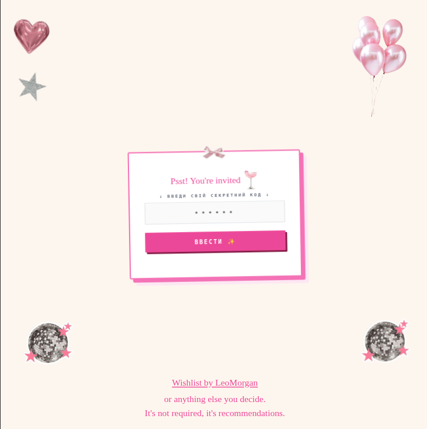

# Birthday Invite — Interactive Party Invitation

A web-based birthday invitation with a secret entrance code, animated guest walkers, and a party card. Built as a reusable template for personal celebrations.

---

## Preview

### Entrance Code Page
Guests are prompted to enter a secret code before seeing the invitation.



> **Entrance code: `MASH25`**

---

### Guest Walkers
An animated screen shows all invited guests walking to the party.


---

### Invitation Card
After entering the correct code, guests see the full party details.


> An invitation card can be created in Pinterest using "Collage" tool. [My collage example.](https://www.pinterest.com/pin/846113848787006592/)

---

## How It Works

1. The guest opens the page and is shown a secret code input form.
2. They enter the code **`MASH25`** to unlock the invitation.
3. An animated scene shows all invited guests heading to the celebration.
4. The invitation card reveals party details (date, time, location).

---

## Project Setup

```sh
npm install
```

### Development (with hot-reload)

```sh
npm run dev
```

### Production Build

```sh
npm run build
```

---

## Customisation

To adapt this template for your own party:

- **Entrance code** — update the secret code value in the source (`MASH25` by default).
- **Party details** — edit the date, time, location, and restaurant fields on the invitation card.
- **Guest list** — update the walker characters with your guests' names.
- **Wishlist link** — replace the wishlist URL shown on the code page.
